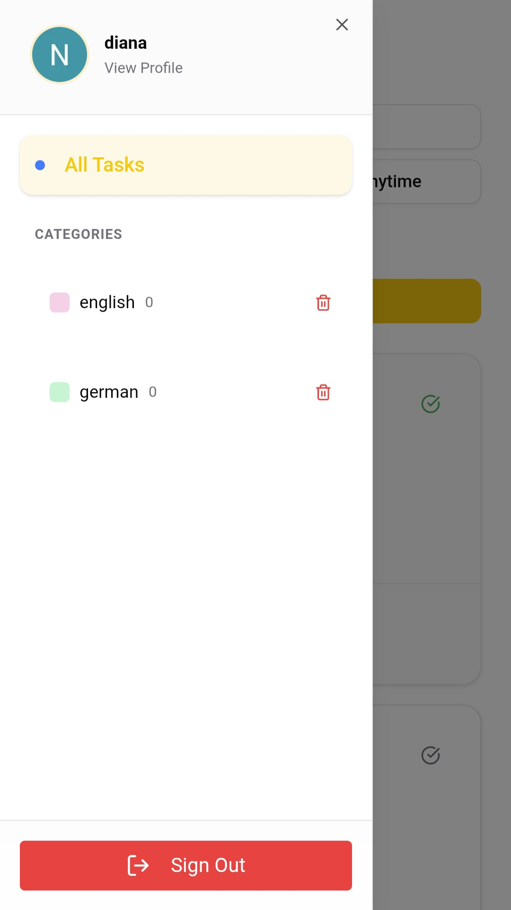
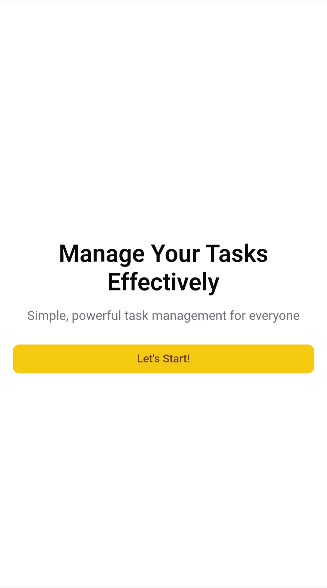
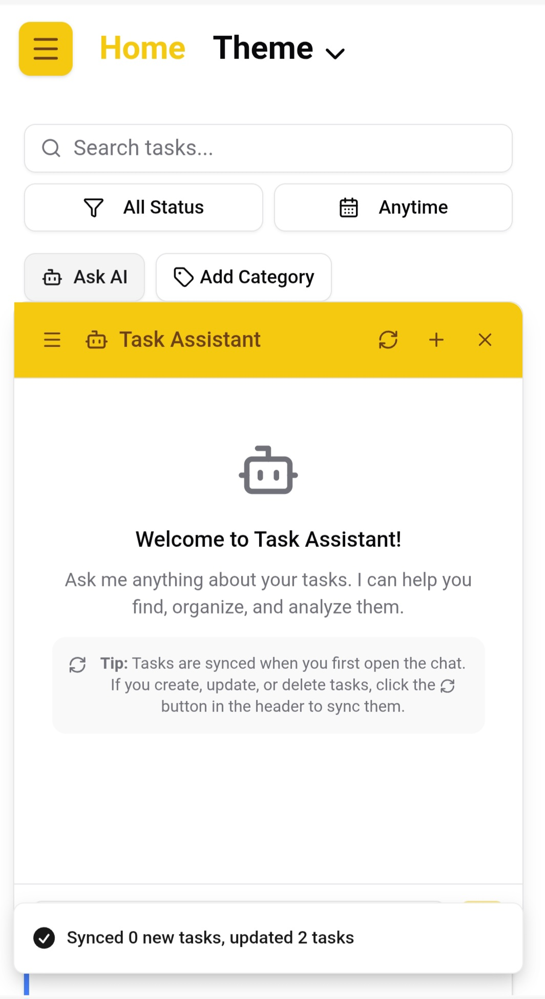
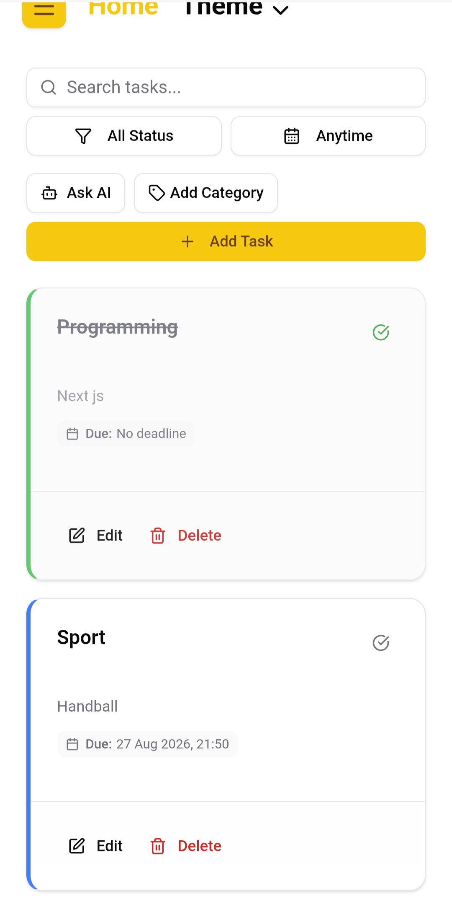

# Task Manager

A full-stack task management application built with **Next.js, TypeScript, PostgreSQL, Prisma, and Better Auth**, featuring an AI assistant for interacting with tasks through natural language.

## Features

* 🔐 Authentication and session management
* ✅ Create, update, and delete tasks
* 🏷️ Task categories
* 📅 Task status and due dates
* 🔎 Task filtering and organization
* 🤖 AI-powered task assistant
* 🧠 Semantic task search using embeddings
* 💬 Persistent AI conversations
* 🛡️ Server-side validation and authorization
* ⚡ Server-state management with TanStack Query
* 🎨 UI built with shadcn/ui
* 📱 Responsive UI

## AI Assistant

The AI assistant allows users to ask natural-language questions about their tasks.

For example:

> "Which tasks are related to my programming studies?"

> "What should I prioritize?"

> "Which unfinished tasks are related to React?"

The application uses **Gemini embeddings** and **cosine similarity** to retrieve tasks that are semantically relevant to the user's question before generating a response with **Gemini 2.5 Flash**.

```text
User Question
      ↓
Query Embedding
      ↓
Semantic Similarity
      ↓
Relevant Tasks
      ↓
Context + Conversation History
      ↓
Gemini 2.5 Flash
      ↓
AI Response
```

## Tech Stack

### Frontend

* Next.js
* React
* TypeScript
* Tailwind CSS
* shadcn/ui
* TanStack Query
* React Hook Form
* Zod

### Backend

* Next.js API Routes
* Prisma
* PostgreSQL
* Better Auth

### AI

* Google Gemini
* Gemini Embeddings
* Gemini 2.5 Flash
* Cosine Similarity

### Database / Infrastructure

* PostgreSQL
* Neon

## Architecture

```text
┌──────────────────────┐
│      Next.js UI      │
│ React + TanStack     │
│ Query + TypeScript   │
└──────────┬───────────┘
           │
           ▼
┌──────────────────────┐
│      API Layer       │
│ Auth • Validation    │
│ Authorization        │
└───────┬────────┬─────┘
        │        │
        ▼        ▼
   ┌────────┐ ┌─────────┐
   │ Prisma │ │ Gemini  │
   │   +    │ │   AI    │
   │Postgres│ │         │
   └────────┘ └─────────┘
```

## Security

* Session-based authentication with Better Auth
* Server-side input validation with Zod
* User-scoped database queries
* Resource ownership validation
* Protected API endpoints
* User-specific task retrieval for the AI assistant
```

## Getting Started

### Requirements

* Node.js
* PostgreSQL database
* Google Gemini API key

### Installation

```bash
git clone https://github.com/njmeN/task-manager.git
cd task-manager
npm install
```

Create a `.env` file:

```env
DATABASE_URL=
BETTER_AUTH_SECRET=
BETTER_AUTH_URL=
GOOGLE_CLIENT_ID=
GOOGLE_CLIENT_SECRET=
GOOGLE_GENERATIVE_AI_API_KEY=
```

Run the database migrations:

```bash
npx prisma migrate dev
```

Start the development server:

```bash
npm run dev
```

The application will be available at `http://localhost:3000`.

## Screenshots












